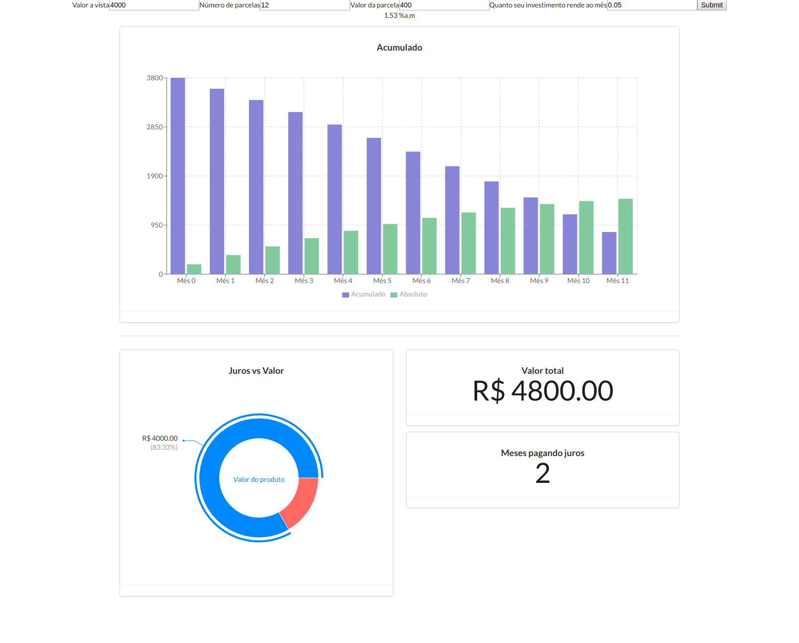

# Payment method check

under construction

Check whether purchases in installments with interests charges are a better deal than buy in cash

## It should consider
* Any investments you have and the return value per month (%)
* Value in cash
* Number of installments
* installment value

Still to be considered 
* inflation rate

 

 It its a better deal if we can keep the blue line above 0 during the entire period

Check it out:  https://focused-meitner-6e2092.netlify.com/
 